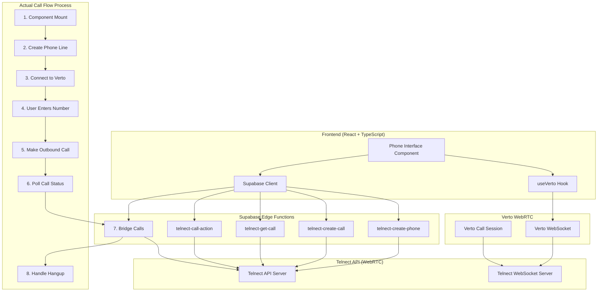
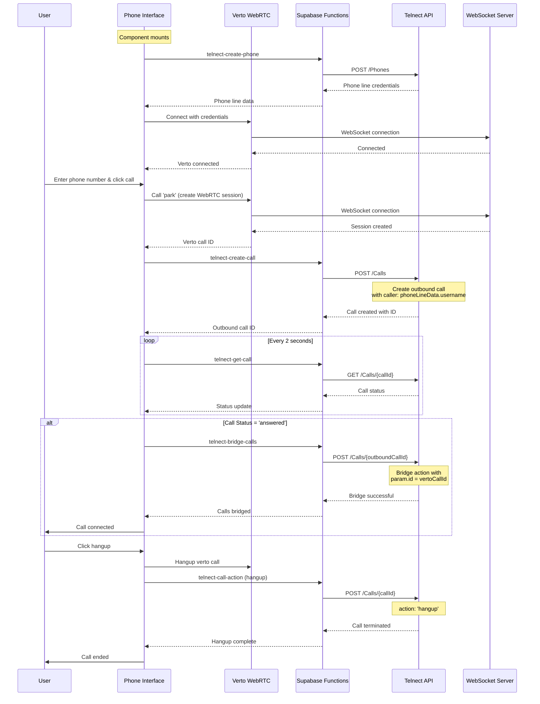

# Call Flow Architecture Diagram

## Current Implementation Analysis

**DISCREPANCIES FOUND:**

1. **Caller Number**: The diagram shows fixed caller `+46752751354`, but current code uses `phoneLineData?.username`
2. **Hangup Method**: The diagram shows `DELETE /Calls/{callId}`, but current code uses `POST` with `action: 'hangup'`
3. **Missing Phone Line Creation**: The diagram doesn't show the initial phone line creation step

## Corrected System Architecture



## Corrected Call Flow Sequence



## Current Implementation Details

### **Actual API Calls:**

1. **Phone Line Creation:**
   ```javascript
   // telnect-create-phone
   POST /Phones
   Body: { allow_features: ['inbound', 'outbound', 'websocket'], type: 'dynamic', max_expire: 86400 }
   ```

2. **Outbound Call Creation:**
   ```javascript
   // telnect-create-call
   POST /Calls
   Body: { caller: phoneLineData.username, number: phoneNumber, notifyUrl: ... }
   ```

3. **Call Status Polling:**
   ```javascript
   // telnect-get-call
   GET /Calls/{callId}
   ```

4. **Bridging:**
   ```javascript
   // telnect-bridge-calls
   POST /Calls/{outboundCallId}
   Body: { actions: [{ action: "bridge", param: { id: vertoCallId } }] }
   ```

5. **Hangup:**
   ```javascript
   // telnect-call-action
   POST /Calls/{callId}
   Body: { actions: [{ action: "hangup" }] }
   ```

### **Key Differences from Diagram:**

1. **Caller Number**: Uses `phoneLineData.username` instead of fixed `+46752751354`
2. **Hangup Method**: Uses `POST` with action instead of `DELETE`
3. **Phone Line Creation**: Happens on component mount, not user action
4. **Verto Connection**: Uses phone line credentials, not separate WebSocket credentials

### **Current Call States:**
- `idle` - No active call
- `connecting` - Creating calls
- `calling` - Calls created, waiting for answer
- `answered` - Call answered and bridged
- `hangup` - Call terminated

This corrected diagram now accurately reflects the current implementation.
