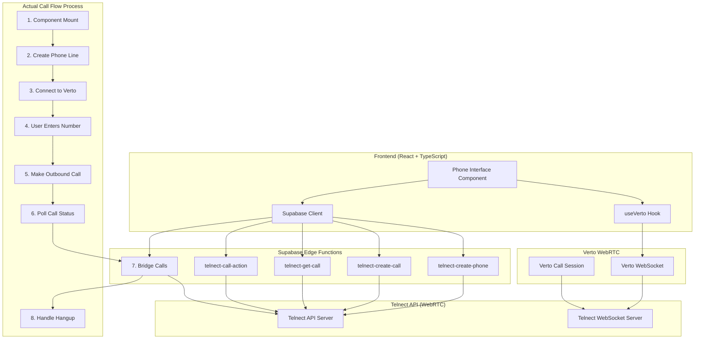
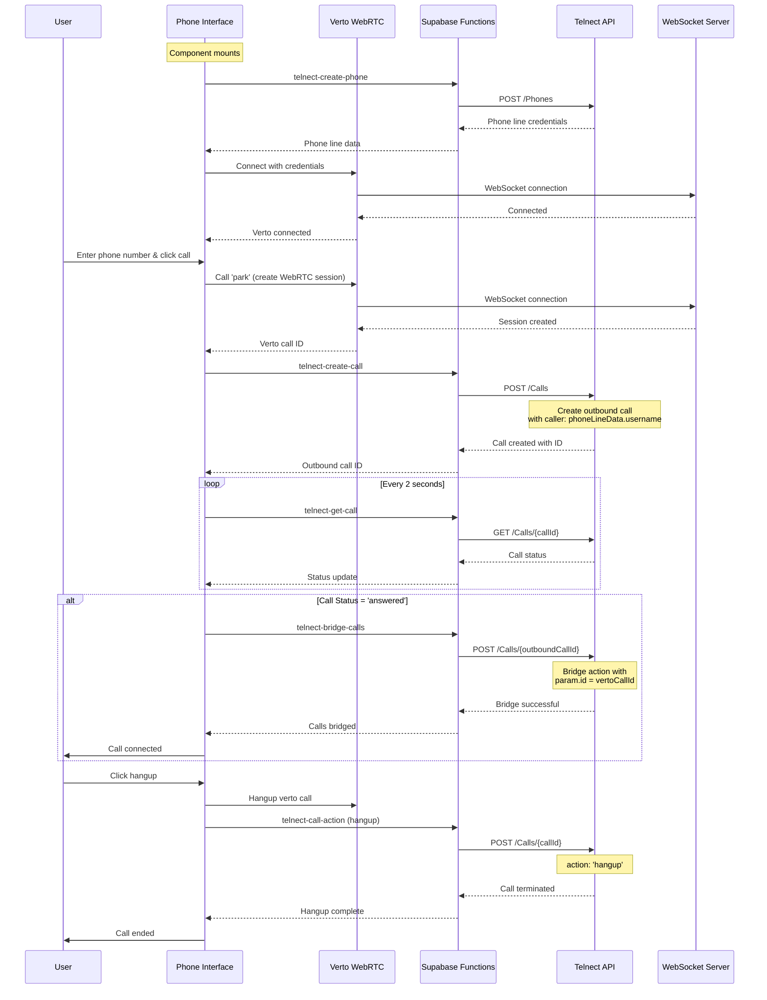

# Call Flow Architecture Diagram

## Current Implementation Analysis

**DISCREPANCIES FOUND:**

1. **Caller Number**: The diagram shows fixed caller `+46752751354`, but current code uses `phoneLineData?.username`
2. **Hangup Method**: The diagram shows `DELETE /Calls/{callId}`, but current code uses `POST` with `action: 'hangup'`
3. **Missing Phone Line Creation**: The diagram doesn't show the initial phone line creation step

## Detailed Communication Flowchart

```mermaid
flowchart TD
    %% User Nodes
    User[👤 User]
    
    %% Frontend Nodes
    Login[🔐 Login System]
    PhoneInterface[📱 Phone Interface Component]
    VertoHook[🔌 useVerto Hook]
    SupabaseClient[📡 Supabase Client]
    
    %% Supabase Edge Function Nodes
    CreatePhoneFunc[⚡ telnect-create-phone]
    CreateCallFunc[⚡ telnect-create-call]
    GetCallFunc[⚡ telnect-get-call]
    CallActionFunc[⚡ telnect-call-action]
    BridgeCallsFunc[⚡ telnect-bridge-calls]
    
    %% External Service Nodes
    SupabaseAuth[🔑 Supabase Auth]
    TelnectAPI[🌐 Telnect API Server]
    TelnectWS[🔌 Telnect WebSocket Server]
    VertoWS[🔌 Verto WebSocket Server]
    
    %% Flow Steps
    subgraph "1. User Login Flow"
        User -->|"1.1 Enter credentials"| Login
        Login -->|"1.2 Authenticate"| SupabaseAuth
        SupabaseAuth -->|"1.3 Return session"| Login
        Login -->|"1.4 Login success"| User
    end
    
    subgraph "2. Component Initialization"
        User -->|"2.1 Navigate to phone interface"| PhoneInterface
        PhoneInterface -->|"2.2 Component mounts"| CreatePhoneFunc
        CreatePhoneFunc -->|"2.3 POST /Phones"| TelnectAPI
        TelnectAPI -->|"2.4 Phone line credentials"| CreatePhoneFunc
        CreatePhoneFunc -->|"2.5 Phone line data"| PhoneInterface
        PhoneInterface -->|"2.6 Connect to Verto"| VertoHook
        VertoHook -->|"2.7 WebSocket connection"| VertoWS
        VertoWS -->|"2.8 Connected"| VertoHook
        VertoHook -->|"2.9 Verto ready"| PhoneInterface
    end
    
    subgraph "3. User Makes Call"
        User -->|"3.1 Enter phone number"| PhoneInterface
        User -->|"3.2 Click call button"| PhoneInterface
        PhoneInterface -->|"3.3 Call 'park'"| VertoHook
        VertoHook -->|"3.4 Create WebRTC session"| VertoWS
        VertoWS -->|"3.5 Session created"| VertoHook
        VertoHook -->|"3.6 Verto call ID"| PhoneInterface
        PhoneInterface -->|"3.7 Create outbound call"| CreateCallFunc
        CreateCallFunc -->|"3.8 POST /Calls"| TelnectAPI
        TelnectAPI -->|"3.9 Call created"| CreateCallFunc
        CreateCallFunc -->|"3.10 Outbound call ID"| PhoneInterface
    end
    
    subgraph "4. Call Status Polling"
        PhoneInterface -->|"4.1 Start polling"| GetCallFunc
        GetCallFunc -->|"4.2 GET /Calls/{callId}"| TelnectAPI
        TelnectAPI -->|"4.3 Call status"| GetCallFunc
        GetCallFunc -->|"4.4 Status update"| PhoneInterface
        PhoneInterface -->|"4.5 Check if answered"| PhoneInterface
    end
    
    subgraph "5. Call Bridging"
        PhoneInterface -->|"5.1 Call answered - bridge"| BridgeCallsFunc
        BridgeCallsFunc -->|"5.2 POST /Calls/{outboundCallId}"| TelnectAPI
        TelnectAPI -->|"5.3 Bridge action"| TelnectAPI
        Note over TelnectAPI: action: 'bridge'<br/>param.id = vertoCallId
        TelnectAPI -->|"5.4 Bridge successful"| BridgeCallsFunc
        BridgeCallsFunc -->|"5.5 Calls bridged"| PhoneInterface
        PhoneInterface -->|"5.6 Call connected"| User
    end
    
    subgraph "6. User Hangs Up"
        User -->|"6.1 Click hangup"| PhoneInterface
        PhoneInterface -->|"6.2 Hangup Verto call"| VertoHook
        VertoHook -->|"6.3 Terminate WebRTC"| VertoWS
        VertoWS -->|"6.4 Call ended"| VertoHook
        PhoneInterface -->|"6.5 Hangup Telnect call"| CallActionFunc
        CallActionFunc -->|"6.6 POST /Calls/{callId}"| TelnectAPI
        TelnectAPI -->|"6.7 Hangup action"| TelnectAPI
        Note over TelnectAPI: action: 'hangup'
        TelnectAPI -->|"6.8 Call terminated"| CallActionFunc
        CallActionFunc -->|"6.9 Hangup complete"| PhoneInterface
        PhoneInterface -->|"6.10 Call ended"| User
    end
    
    %% Styling
    classDef userNode fill:#e1f5fe,stroke:#01579b,stroke-width:2px
    classDef frontendNode fill:#f3e5f5,stroke:#4a148c,stroke-width:2px
    classDef supabaseNode fill:#fff3e0,stroke:#e65100,stroke-width:2px
    classDef externalNode fill:#e8f5e8,stroke:#1b5e20,stroke-width:2px
    
    class User userNode
    class Login,PhoneInterface,VertoHook,SupabaseClient frontendNode
    class CreatePhoneFunc,CreateCallFunc,GetCallFunc,CallActionFunc,BridgeCallsFunc supabaseNode
    class SupabaseAuth,TelnectAPI,TelnectWS,VertoWS externalNode
```

## Communication Matrix

| From Node | To Node | Communication Type | API Endpoint | Purpose |
|-----------|---------|-------------------|--------------|---------|
| User | Login | UI Interaction | - | Enter credentials |
| Login | Supabase Auth | HTTP | POST /auth/v1/token | Authenticate user |
| User | Phone Interface | UI Interaction | - | Navigate to phone |
| Phone Interface | telnect-create-phone | HTTP | POST /functions/v1/telnect-create-phone | Create phone line |
| telnect-create-phone | Telnect API | HTTP | POST /Phones | Get phone credentials |
| Phone Interface | useVerto Hook | JavaScript | - | Connect to WebRTC |
| useVerto Hook | Verto WebSocket | WebSocket | wss://phone.telnect.com/webrtc | WebRTC connection |
| User | Phone Interface | UI Interaction | - | Enter phone number |
| Phone Interface | useVerto Hook | JavaScript | - | Create park call |
| useVerto Hook | Verto WebSocket | WebSocket | - | WebRTC session |
| Phone Interface | telnect-create-call | HTTP | POST /functions/v1/telnect-create-call | Create outbound call |
| telnect-create-call | Telnect API | HTTP | POST /Calls | Create PSTN call |
| Phone Interface | telnect-get-call | HTTP | POST /functions/v1/telnect-get-call | Poll call status |
| telnect-get-call | Telnect API | HTTP | GET /Calls/{callId} | Get call status |
| Phone Interface | telnect-bridge-calls | HTTP | POST /functions/v1/telnect-bridge-calls | Bridge calls |
| telnect-bridge-calls | Telnect API | HTTP | POST /Calls/{callId} | Bridge action |
| User | Phone Interface | UI Interaction | - | Click hangup |
| Phone Interface | useVerto Hook | JavaScript | - | Hangup Verto call |
| useVerto Hook | Verto WebSocket | WebSocket | - | Terminate WebRTC |
| Phone Interface | telnect-call-action | HTTP | POST /functions/v1/telnect-call-action | Hangup Telnect call |
| telnect-call-action | Telnect API | HTTP | POST /Calls/{callId} | Hangup action |

## Corrected System Architecture



## Corrected Call Flow Sequence



## Current Implementation Details

### **Actual API Calls:**

1. **Phone Line Creation:**
   ```javascript
   // telnect-create-phone
   POST /Phones
   Body: { allow_features: ['inbound', 'outbound', 'websocket'], type: 'dynamic', max_expire: 86400 }
   ```

2. **Outbound Call Creation:**
   ```javascript
   // telnect-create-call
   POST /Calls
   Body: { caller: phoneLineData.username, number: phoneNumber, notifyUrl: ... }
   ```

3. **Call Status Polling:**
   ```javascript
   // telnect-get-call
   GET /Calls/{callId}
   ```

4. **Bridging:**
   ```javascript
   // telnect-bridge-calls
   POST /Calls/{outboundCallId}
   Body: { actions: [{ action: "bridge", param: { id: vertoCallId } }] }
   ```

5. **Hangup:**
   ```javascript
   // telnect-call-action
   POST /Calls/{callId}
   Body: { actions: [{ action: "hangup" }] }
   ```

### **Key Differences from Diagram:**

1. **Caller Number**: Uses `phoneLineData.username` instead of fixed `+46752751354`
2. **Hangup Method**: Uses `POST` with action instead of `DELETE`
3. **Phone Line Creation**: Happens on component mount, not user action
4. **Verto Connection**: Uses phone line credentials, not separate WebSocket credentials

### **Current Call States:**
- `idle` - No active call
- `connecting` - Creating calls
- `calling` - Calls created, waiting for answer
- `answered` - Call answered and bridged
- `hangup` - Call terminated

This corrected diagram now accurately reflects the current implementation.
